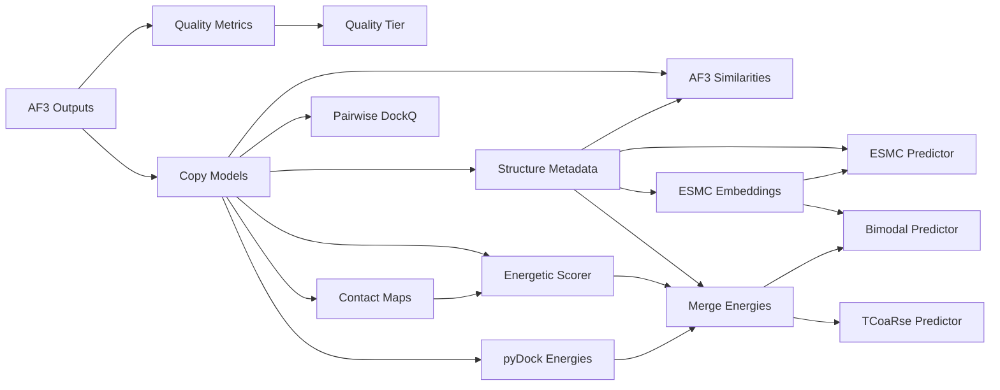

# TCoaRse blocks

TCoaRse predicts **TCR–pMHC binding** from AlphaFold3 models of the complex. It
scores each model three ways — from its coarse-grained + pyDock energies, from
ESMC sequence embeddings, and from both combined — and reports how reliable each
model is (quality tier, convergence between seeds, similarity to the training
set).

These blocks are a Horus port of
[TCoaRse-nf](https://github.com/BSC-CNS-EAPM/TCoaRse-nf)'s
`tcoarse_prediction.nf`: one block per Nextflow process, same scripts, same
outputs.

---

## 1. Requirements

| What | Why | Note |
|---|---|---|
| A TCoaRse-nf checkout | holds `scripts/`, `src/`, `pydock/`, `pretrained_models/`, `data/` | on the machine that runs the jobs |
| A python environment with the TCoaRse dependencies | torch, transformers, DockQ, tcrdist, anarci, h5py, Levenshtein, joblib… | **not** installed by the plugin |
| The pyDock Singularity image | only for the *pyDock Energies* block | e.g. `pydock3_cythonize_20260622.sif` |
| A folder of AlphaFold3 outputs | the input of the pipeline | one subfolder per complex |
| A GPU | only for *ESMC Embeddings* with `device = cuda` | CPU works, slower |

The heavy scientific stack is deliberately kept out of `plugin.meta`: the blocks
shell out to the TCoaRse scripts instead of importing them, so you point the
plugin at an environment that already works.

### Expected AF3 outputs layout

```
examples/                     <- this folder is what you select
├── tcr_17/
│   ├── tcr_17_model.cif
│   ├── tcr_17_confidences.json
│   ├── tcr_17_summary_confidences.json
│   ├── seed-678364767_sample-0/
│   └── …
├── tcr_18/
└── …
```

Every result file is prefixed with the **name of the flow**, sanitized into
something usable as a filename: a flow named `examples` writes
`examples_metrics.csv`, `examples_pdb/`, …

(The Nextflow pipeline used `params.basename`, the name of the AF3 outputs
folder. Name the flow after the dataset to get the same filenames.)

---

## 2. How the blocks execute

Every block except *AF3 Outputs* is a `SlurmBlock` submitted through the shared
BSC launcher (`Include/slurm_utils.py`). For each block Horus:

1. builds the command line from the configuration and the block variables,
2. creates a run folder (the flow folder locally, a copy of it on the remote),
3. uploads only the inputs that job needs,
4. runs it — locally as a background script, on a cluster as a SLURM job,
5. downloads the results back into the flow folder.

Two consequences worth knowing:

- **Every output is a file in the flow folder.** Outputs are wired between
  blocks as paths; an input coming from anywhere else is copied into the flow
  folder first, because the job only ever sees that folder.
- **The AF3 outputs folder is never uploaded.** It is typically large and
  already sits on the cluster, so it is used in place: the path you select must
  be valid *on the machine that runs the jobs*.

---

## 3. Setup

### 3.1 Plugin configuration

*Settings → Plugins → Immunoinformatics → **TCoaRse***. Only the first two
fields are normally needed; everything else defaults to a path inside the
installation folder and is there for non-standard layouts.

| Field | Required | Default / example |
|---|---|---|
| **TCoaRse installation folder** | yes | `/gpfs/projects/bsc72/…/TCoaRse-nf` |
| **TCoaRse python executable** | recommended | `…/conda_envs/tcoarse/bin/python` |
| **Cluster conda environment** | cluster only | `/gpfs/projects/bsc72/conda_envs/tcoarse` → `source activate …` in the job |
| **Cluster modules** | cluster only | `bsc/1.0, anaconda, singularity` (add `cuda/12.6` for embeddings) |
| **pyDock Singularity image** | pyDock block | `/gpfs/…/pydock3_cythonize_20260622.sif` |
| Scripts folder | no | `<root>/scripts` |
| Src folder | no | `<root>/src` |
| pyDock folder | no | `<root>/pydock` |
| TCoaRse model | no | `<root>/pretrained_models/tcoarse.json` |
| Bimodal model | no | `<root>/pretrained_models/bimodal.json` |
| ESMC model | no | `<root>/pretrained_models/esmc.json` |
| Quality classifier | no | `<root>/pretrained_models/rf_quality.pkl` |
| Statistical potentials folder | no | `<root>/pretrained_models/potential` |
| AF3 training CSV | no | `<root>/data/af3_training.csv` |
| AF3 training PDBs folder | no | `<root>/data/pdbs` |

**Give the python executable as an absolute path inside the environment**
(`…/bin/python`). The conda environment and modules are only applied on
MareNostrum; an absolute interpreter works everywhere, including local runs.

### 3.2 Per-block job settings

Each block carries the shared BSC Slurm variables:

| Variable | Meaning |
|---|---|
| **Partition** | `gp_bscls`, `gp_debug`, `acc_bscls`, `acc_debug`, … |
| **CPUs** | tasks requested; running locally, how many jobs run in parallel |
| **CPUs per task** | CPUs of the task — **this is what sets `--workers`** in the scripts |
| **GPUs** | *ESMC Embeddings* only: `--gres gpu:N`, needs an `acc_*` partition |
| **Environment variables** | extra `export K=V` lines in the job |
| **Script name** | name of the generated submission script |
| **Remove remote folder on finish** | delete the run folder on the remote after downloading |

The TCoaRse scripts parallelize with threads/processes *inside a single task*,
so raise **CPUs per task**, not CPUs. Leaving both at 1 falls back to each
script's own default.

Select the remote per block with the usual Horus block remote selector; `Local`
runs everything on the machine hosting Horus.

---

## 4. The flow



Read as four branches off the AF3 predictions:

1. **Quality** — *Quality Metrics* → *Quality Tier*. Scores how good each
   AlphaFold3 model is (pDockQ, pDockQ2, ipSAE, PAE) and classifies it into a
   tier. Independent from the predictions; use it to decide which models to
   trust.
2. **Structures** — *Copy Models* turns the AF3 output tree into one merged PDB
   per model, and *Structure Metadata* reads the TCR/peptide/MHC sequences back
   out of those structures. Everything downstream hangs off these two.
3. **Sequence** — *ESMC Embeddings* → *ESMC Predictor*. A prediction from
   sequence alone, no structure or energy involved. Useful as a baseline and as
   the second half of the bimodal model.
4. **Energy** — *Contact Maps* → *Energetic Scorer* (coarse-grained potentials)
   and *pyDock Energies* (electrostatics, desolvation, VdW), merged with the
   metadata by *Merge Energies* into the feature table that feeds the *TCoaRse
   Predictor* and, together with the embeddings, the *Bimodal Predictor*.

Two side branches produce diagnostics rather than predictions: *AF3
Similarities* (how close the new complexes are to the training set — a near
duplicate makes an optimistic prediction) and *Pairwise DockQ* (how much the
seeds of one complex agree with each other).

The three predictors are independent: you can run only the sequence branch
(cheap, no pyDock, no structures beyond `Copy Models` + `Structure Metadata`) or
only the energy branch. The preset wires all of them.

### Running the preset

The wired pipeline ships as the **TCoaRse** flow preset. Open it, select the
folder in *AF3 Outputs*, set the remote and the job settings, and run.

Regenerate the preset after changing any block or port id:

```bash
python Devtools/generate_tcoarse_flow.py
```

### Suggested first run

Start with `Copy Models → Structure Metadata → Contact Maps → Energetic Scorer`
on a handful of complexes. It exercises the configuration, the remote and the
upload/download round trip in minutes and without a GPU or the pyDock container.

---

## 5. Block reference

Ids are prefixed with `immuno.` inside flows. "Runs" is the TCoaRse script the
job executes.

### AF3 Outputs · `tcoarse_af3_outputs`

Entry point of the pipeline. Validates the AlphaFold3 outputs folder on the
machine that will run the jobs and passes it downstream.

- **Variables** — *AF3 outputs folder*
- **Outputs** — *AF3 outputs* (folder)
- Not a job: it only runs `ls` over the selected folder on the remote.

### Quality Metrics · `tcoarse_quality_metrics`

Computes per-model quality metrics: pDockQ, pDockQ2, ipSAE, PAE-derived scores
and contact checks. The most expensive step after pyDock — it reads every seed
of every complex.

- **Runs** `process_folder.py`
- **Inputs** — *AF3 outputs*
- **Variables** — *pLDDT threshold* (70), *Seed workers* (4), *Fast mode*,
  *Verbose*
- **Outputs** — *Metrics CSV* → `<name>_metrics.csv`
- *Fast mode* skips the expensive recomputation and reuses metrics already
  present in the AF3 folders.
- Nothing is uploaded: it reads the AF3 folder in place.

### Quality Tier · `tcoarse_quality_tier`

Classifies each model into a quality tier with the pretrained random forest.

- **Runs** `quality_tier.py`
- **Inputs** — *Metrics CSV*
- **Variables** — *Thresholds* (optional, overrides the model's), *Show results*
- **Outputs** — *Quality CSV* → `<name>_quality.csv`

### Copy Models · `tcoarse_copy_models`

Collects the AF3 prediction of every seed/sample and writes it as a single
merged PDB, producing the structure folder the rest of the pipeline consumes.

- **Runs** `cp_models.py`
- **Inputs** — *AF3 outputs*
- **Variables** — job settings only (`--workers`, default 4)
- **Outputs** — *PDB folder* → `<name>_pdb/`

### Structure Metadata · `tcoarse_structure_metadata`

Reads the TCR (CDR3s, V/J genes), peptide and MHC sequences back out of the
structures into a table keyed by `tcr_id` + `model_number`.

- **Runs** `metadata_from_str.py`
- **Inputs** — *PDB folder*
- **Outputs** — *Metadata CSV* → `<name>_metadata.csv`

### AF3 Similarities · `tcoarse_similarities`

Compares the new complexes with the set used to train the models, in sequence
and in structure. A high similarity means the prediction for that complex is
close to something already seen.

- **Runs** `similarities_af3.py`
- **Inputs** — *Metadata CSV*, *PDB folder*
- **Variables** — *Jobs* (`-1` = every core)
- **Outputs** — *Sequence similarity* → `sim_seq.csv`, *Structure similarity* →
  `sim_str.csv`
- Uses the *AF3 training CSV* and *AF3 training PDBs folder* from the config.

### ESMC Embeddings · `tcoarse_embeddings`

Generates ESMC embeddings of the TCR–pMHC sequences. The only GPU step.

- **Runs** `emb_generator.py`
- **Inputs** — *Metadata CSV*
- **Variables** — *GPUs*, *Device* (`cuda`/`cpu`/`mps`), *Normalize* (on),
  *Disable torch.compile* (on), *Batch size* (optional)
- **Outputs** — *Embeddings* → `<name>_embeddings.h5`
- With `device = cuda`, set *GPUs* to 1 and an `acc_*` partition; the block warns
  if you ask for CUDA with no GPUs requested.
- Keep *Disable torch.compile* on unless you know compilation works in your
  environment — it otherwise tends to stall.

### ESMC Predictor · `tcoarse_predictor_esmc`

Predicts binding from the embeddings alone — no structural or energetic
features.

- **Runs** `predictor_esmc.py`
- **Inputs** — *Metadata CSV*, *Embeddings*
- **Variables** — *Model* (overrides the configured `esmc.json`), *Show results*
- **Outputs** — *ESMC predictions* → `<name>_esmc_predictions.csv`

### pyDock Energies · `tcoarse_pydock`

Scores every model with pyDock inside its Singularity container and packs the
resulting `.ene` files into one archive. Usually the longest step.

- **Runs** `pydock/01_make_manifest.py`, `02_make_chunks.py`,
  `03_validate_chain_mapping.py`, then `worker_chunk.py` once per chunk
- **Inputs** — *PDB folder*
- **Variables** — *Complexes per chunk* (5000), *pyDock modules* (`bindEy`)
- **Outputs** — *pyDock energies* → `<name>_pydock_ene.tar`
- The `config.yaml` is generated in the run folder from the configuration; the
  Singularity image comes from the *pyDock Singularity image* setting.
- Lower *Complexes per chunk* to split the work into more, shorter jobs.

### Contact Maps · `tcoarse_contact_maps`

Computes the residue contact map of every model, the input of the energetic
scorer.

- **Runs** `contact_maps.py`
- **Inputs** — *PDB folder*
- **Variables** — *Chain map* (`D:E:C:B:A`), *Predicted structures* (on)
- **Outputs** — *Contact maps folder* → `<name>_cm/`
- *Predicted structures* is the script's `-notexp`: keep it on for AlphaFold3
  models, turn it off for experimental structures.

### Pairwise DockQ · `tcoarse_pairwise_dockq`

DockQ between the different models of the same complex — a convergence measure
of the prediction. A diagnostic branch, nothing consumes it downstream.

- **Runs** `pw_sim.py`
- **Inputs** — *PDB folder*
- **Outputs** — *Pairwise DockQ* → `<name>_pairwise_dockq.csv`

### Energetic Scorer · `tcoarse_energetic_scorer`

Scores the TCR–peptide, TCR–MHC and peptide–MHC contacts with the TCoaRse
statistical potentials.

- **Runs** `energetic_scorer.py`
- **Inputs** — *Contact maps folder*, *PDB folder*
- **Variables** — *Chain map* (`D:E:C:A:B`), *Contact threshold* (7 Å),
  *IO workers* (8), *Predicted structures* (on)
- **Outputs** — *TCoaRse energies* → `<name>_tcoarse_energies.csv`
- Note the chain map default differs from *Contact Maps* — that mirrors the
  defaults of the two scripts.

### Merge Energies · `tcoarse_merge_energies`

Unpacks the pyDock archive and merges its energies with the coarse-grained ones
and the metadata into the feature table the predictors expect.

- **Runs** `merge_energies.py`
- **Inputs** — *TCoaRse energies*, *Metadata CSV*, *pyDock energies*,
  *Metrics CSV* (optional)
- **Outputs** — *Merged features* → `<name>_tcoarse_pydock_energies.csv`
- Wiring *Metrics CSV* adds the quality metrics as extra columns. The Nextflow
  pipeline never did this; the underlying script supports it.

### TCoaRse Predictor · `tcoarse_predictor_tcoarse`

Predicts binding from the merged energetic features.

- **Runs** `predictor_tcoarse.py`
- **Inputs** — *Merged features*
- **Variables** — *Model* (overrides `tcoarse.json`), *Show results* (on)
- **Outputs** — *TCoaRse predictions* → `<name>_tcoarse_predictions.csv`

### Bimodal Predictor · `tcoarse_predictor_bimodal`

Predicts binding combining the energetic features with the ESMC embeddings.

- **Runs** `predictor_bimodal.py`
- **Inputs** — *Merged features*, *Embeddings*
- **Variables** — *Model* (overrides `bimodal.json`), *Show results* (on)
- **Outputs** — *Bimodal predictions* → `<name>_bimodal_predictions.csv`

---

## 6. Results

With *Show results* enabled, the predictor blocks load their CSV into the
plugin's results page (the same table view the PredIG blocks use), so you can
sort and filter the predictions without leaving Horus.

All files land in the flow folder, prefixed with the flow name:

| File | Produced by |
|---|---|
| `<name>_metrics.csv` | Quality Metrics |
| `<name>_quality.csv` | Quality Tier |
| `<name>_pdb/` | Copy Models |
| `<name>_metadata.csv` | Structure Metadata |
| `sim_seq.csv`, `sim_str.csv` | AF3 Similarities |
| `<name>_embeddings.h5` | ESMC Embeddings |
| `<name>_esmc_predictions.csv` | ESMC Predictor |
| `<name>_pydock_ene.tar` | pyDock Energies |
| `<name>_cm/` | Contact Maps |
| `<name>_pairwise_dockq.csv` | Pairwise DockQ |
| `<name>_tcoarse_energies.csv` | Energetic Scorer |
| `<name>_tcoarse_pydock_energies.csv` | Merge Energies |
| `<name>_tcoarse_predictions.csv` | TCoaRse Predictor |
| `<name>_bimodal_predictions.csv` | Bimodal Predictor |

---

## 7. Differences with the Nextflow pipeline

- **`quality_tier` no longer overwrites the metrics CSV.** The pipeline declared
  the same output filename for `process_folder` and `quality_tier`, so the
  second overwrote the first in the results folder. The tiers now go to
  `<name>_quality.csv`.
- **ipSAE actually runs.** The pipeline passed `src/ipsae.py` to
  `--ipsae-script`, but `process_folder.py` joins `ipsae.py` to that value, so
  it looked for `…/ipsae.py/ipsae.py`. The block passes the `src/` folder.
- **pyDock processes every chunk**, not only `chunk_000000`, its `config.yaml`
  is generated rather than `sed`-patched (the shipped config no longer contains
  the `__INPUT_DIR__` placeholders the pipeline substituted), and the
  Singularity image is configurable instead of hardcoded to one GPFS path.
- **`merge_energies` can take the metrics CSV**, which the pipeline never wired.
- **Results are prefixed with the flow name**, not with the name of the AF3
  outputs folder. Each process of the pipeline recovered `params.basename` from
  the name of its input file; the flow name is known to every block without
  carrying it along the chain. Name the flow after the dataset to reproduce the
  Nextflow filenames.

---

## 8. Troubleshooting

| Symptom | Cause |
|---|---|
| *"The TCoaRse installation folder is not configured"* | Set it in the plugin settings. |
| *"The pyDock Singularity image is not configured"* | Only the pyDock block needs it. |
| *"The input 'X' is required"* | The port is not connected. |
| *"… was not produced"* | The job ran but wrote nothing — read the job log above the error; usually a wrong python executable, a missing module, or a script error. |
| `ModuleNotFoundError` inside the job | The *TCoaRse python executable* is not the environment's interpreter, or the conda environment/modules are not set for the cluster. |
| CUDA errors or no GPU found | *Device* is `cuda` but *GPUs* is 0 or the partition is not `acc_*`. |
| Very slow steps | *CPUs per task* is still 1, so the scripts run single-threaded. |
| Long transfer times between blocks | Expected: each block uploads its inputs and downloads its results. The AF3 folder is exempt; the `_pdb` and `_cm` folders are not. |

---

## 9. Development

```bash
python Tests/test_tcoarse_blocks.py     # or: python -m pytest Tests -vv
```

The tests fake the block runtime and replace the job launcher with a recorder,
so they check the command line, the uploaded files and the outputs of all 15
blocks in under a second — no TCoaRse dependencies, no cluster.

Source layout:

```
Immunoinformatics/Include/
├── Blocks/TCoaRse/        one file per block
├── Configs/tcoarseConfig.py
├── tcoarse_utils.py       paths, naming, staging, launch/finish helpers
└── slurm_utils.py         shared BSC job launcher
```
